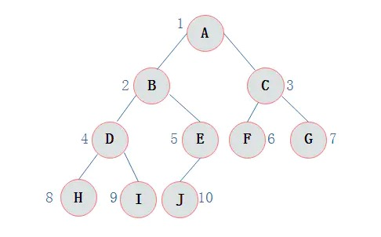

### 基础概念

  + 二叉树：二叉树是一种特殊的树，在二叉树中每个节点最多有两个子节点，一般称为左子节点和右子节点（或左孩子和右孩子），并且二叉树的子树有左右之分，其次序不能任意颠倒。

  + 满二叉树：在一棵二叉树中，如果所有分支结点都有左孩子和右孩子结点，并且叶子结点都集中在二叉树的最下层，这样的树叫做满二叉树

  + 完全二叉树: 个人理解由上至下，由左往右，依次填满，叶子节点只能出现在最下层和次下层。

  + 备注：满二叉树一定是完全二叉树，反之不适用。
  
***

### 二叉树遍历基础概念

  + 二叉树遍历：从二叉树的根结点出发，按照某种次序依次访问二叉树中的所有结点，使得每个结点被访问一次，且仅被访问一次。

  + 深度遍历（Depth-First-Search === DFS）： 是一种用于遍历或搜索树或图的算法。沿着树的深度遍历树的节点，尽可能深的搜索树的分支。当节点 v 的所在边都己被探寻过，搜索将回溯到发现节点 v 的那条边的起始节点。这一过程一直进行到已发现从源节点可达的所有节点为止。如果还存在未被发现的节点，则选择其中一个作为源节点并重复以上过程，整个进程反复进行直到所有节点都被访问为止。属于盲目搜索。其中有常用的前中后遍历3种表现。

  + 前序遍历: 从二叉树的根结点出发，当**第1次**到达结点时就输出结点数据，按照先向左在向右的方向访问。
  
  1. A -> A   => A
  2. A -> B   => B
  3. B -> D   => D
  4. D -> H   => H
  5. H 是叶子结点 -> D
  6. D -> I   => I
  7. I -> D -> B-> E   => E
  8. E -> J   => J
  9. B -> A -> C   => C
  10. C -> F   => F
  11. F -> C -> G   => G

  ***最终顺序： ABDHIEJCFG***

  + 中序遍历: 从二叉树的根结点出发，当**第2次**到达结点时就输出结点数据，按照先向左在向右的方向访问。
  
  1. A -> B -> D -> H
  2. H没有子结点 返回H
  3. 第二次到达H => H
  4. H -> D   => D
  5. D -> I 是叶子结点 -> I
  6. I -> D -> B   => B
  7. B -> E -> J   => J
  8. J -> E   => E
  9. E -> B -> A   => A
  10. A -> C -> F   => F
  11. F -> C   => C
  12. C -> G   => G

  ***最终顺序： HDIBJEAFCG***

  + 后序遍历: 从二叉树的根结点出发，当**第3次**到达结点时就输出结点数据，按照先向左在向右的方向访问。
  
  1. A -> B -> D -> H
  2. H没有左右子结点   => H
  3. H -> D -> I   => I
  4. I -> D   => D
  5. D -> B -> E -> J   => J
  6. J -> E -> 右子结点 -> E => E
  7. E -> B   => B
  8. B -> A -> C -> F   => F
  9. F -> C -> G   => G
  10. G -> C   => C
  11. C -> A   => A

  ***最终顺序： HIDJEBFGCA***